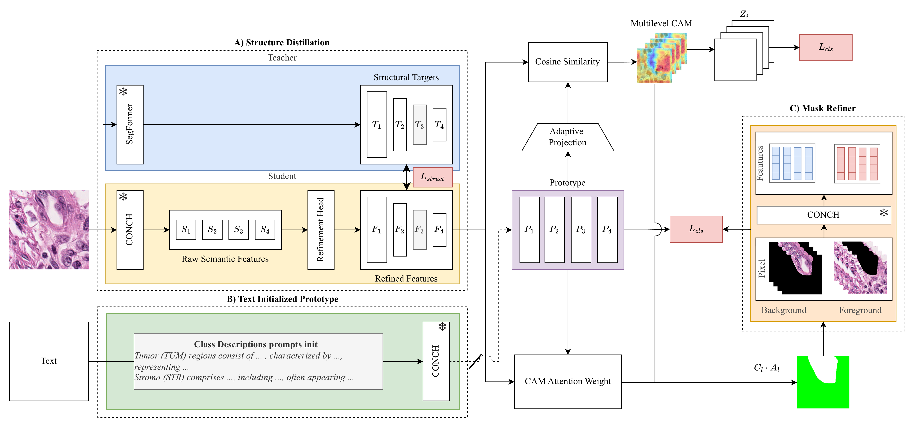

# ConStruct: Structural Distillation of Foundation Models for Prototype-Based Weakly Supervised Histopathology Segmentation

This repository contains the official PyTorch implementation of the paper **"ConStruct: Structural Distillation of Foundation Models for Prototype-Based Weakly Supervised Histopathology Segmentation"**.

## Paper Summary

### **Title and Authorship**
* **Title:** ConStruct: Structural Distillation of Foundation Models for Prototype-Based Weakly Supervised Histopathology Segmentation
* **Authors:** Khang Le, Ha Thach, Anh M. Vu, Trang T. K. Vo, Han H. Huynh, David Yang, Minh H. N. Le, Thanh-Huy Nguyen, Akash Awasthi, Chandra Mohan, Zhu Han, and Hien Van Nguyen (with Khang Le and Ha Thach contributing equally)
* **Venue/Submission:** Proceedings of Machine Learning Research, Under Review: 1-13, 2026 / Full Paper MIDL 2026 submission

### **Core Problem and Motivation**

Weakly Supervised Semantic Segmentation (WSSS) in histopathology is challenging because models trained with image-level labels often focus only on the most *discriminative* tissue regions (the "hot spots") and fail to capture the full *spatial extent* or precise *boundaries* of tissue structures.

The paper addresses the challenge of integrating the strengths of different models under weak supervision:
* **Vision-language foundation models (e.g., CONCH):** Provide rich, morphology-aware, and semantically aligned representations.
* **Modern segmentation backbones (e.g., SegFormer):** Preserve fine-grained spatial cues and multi-scale structural details.
* **ViT-based features:** Often suffer from oversmoothing and loss of spatial locality, leading to blurred segmentation boundaries, despite being semantically strong.

The goal is to design a prototype learning framework that yields prototypes which are **semantically discriminative** and **spatially coherent**.

### **Proposed Method: ConStruct**



The proposed method is a unified **teacher-student distillation framework** built on **text-guided learnable prototypes**. The model is highly parameter-efficient as it **freezes** the foundation model backbones and only trains **lightweight adapters**.

The framework comprises three main components:

#### **A. Structural Knowledge Distillation**
This component transfers fine-grained spatial knowledge from a structural teacher model to the semantic student model.

* **Dual Encoders:**
    * **Teacher (Structural Guidance):** Frozen **SegFormer MiT-B1**.
    * **Student (Semantic Representation):** Frozen **CONCH ViT-B/16**.
* **Lightweight Adapters:** Trainable adapters (residual modules with a $1\times1\rightarrow3\times3(dw)\rightarrow1\times1$ bottleneck design) are introduced to refine the CONCH (student) features. This ensures high parameter efficiency, with only 6.3M trainable parameters (3.7% of the total).
* **Relational Structural Distillation:** Instead of aligning individual feature vectors, the method aligns **pairwise token relations** to transfer boundary-aware structural knowledge.
    * Affinity matrices ($A_{k}^{stu}$ and $A_{k}^{tea}$) encode token-to-token similarity for both student and teacher features.
    * The structural loss $\mathcal{L}_{struct}$ is an MSE loss averaged across selected guidance layers between the student and teacher affinity matrices.

#### **B. Text-Guided CAM Generation (Prototype Learning)**
This component generates improved pseudo-masks by using text to initialize class prototypes, which helps address the coverage limitations of standard CAMs.

* **Text-Initialized Prototypes:** Detailed pathology descriptions for each class (e.g., TUM, STR, LYM, NEC) are encoded using the **frozen CONCH text tower** to initialize the prototypes. A shared two-layer MLP projects the text embeddings to the visual feature dimension, forming a learnable prototype bank.
* **Prototype-to-Feature Similarity:** The prototypes are aligned with the refined student features $R_4$ via an **Adaptive Layer**. Cosine similarity between the normalized refined features and the aligned prototypes yields **Class Activation Maps (CAMs)**.
* **Supervision:** Standard image-level classification loss ($\mathcal{L}_{cls}$) is applied to the CAMs via Global Average Pooling (GAP).

#### **C. Mask Refinement**
This is an inference-only module used to refine the coarse CAMs into precise pixel-level predictions.

* **Adaptive Thresholding:** Pseudo masks are generated from the CAMs using adaptive thresholding (with $\alpha=0.5$) to define foreground (FG) and background (BG) regions.
* **Foreground/Background Contrastive Alignment:** An InfoNCE-style contrastive loss ($\mathcal{L}_{sim}$) is used during training to refine the feature space:
    * **FG Loss ($\mathcal{L}_{fg}$):** FG features (encoded by a frozen CONCH image encoder) are pulled toward their corresponding class prototypes and pushed away from other class prototypes and a memory bank of negative samples.
    * **BG Loss ($\mathcal{L}_{bg}$):** BG features are attracted to background prototypes and repelled from all foreground prototypes.
* **Dense Conditional Random Field (CRF):** Applied during inference as a post-processing step to further refine object boundaries and impose spatial consistency, using both a smoothness kernel and an appearance kernel.

#### **Total Training Objective**
The final training loss is a weighted sum of the three components:
$\mathcal{L}_{total} = \lambda_{cls}\mathcal{L}_{cls} + \lambda_{struct}\mathcal{L}_{struct} + \lambda_{sim}\mathcal{L}_{sim}$
(Weights used: $\lambda_{cls}=1.0$, $\lambda_{struct}=1.5$, and $\lambda_{sim}=0.2$)

### **Key Results and Contributions**

#### **Quantitative Results**
The method was evaluated on the **BCSS-WSSS dataset** (four tissue classes: Tumor (TUM), Stroma (STR), Lymphocyte (LYM), and Necrosis (NEC)).

* The proposed method achieved state-of-the-art performance:
    * **mIoU:** **70.96%** (best among baselines)
    * **mDice:** **82.83%** (best among baselines)
* It achieved the highest IoU and Dice for **Tumor (TUM)** and **Necrosis (NEC)**, which are noted as the most challenging classes due to variable shapes and boundaries.

#### **Ablation Study**
Removing the **Relational Structural Distillation** module showed a drop in performance, demonstrating its importance:
* Full model (w distill.): mIoU **70.96%**, mDice **82.83%**
* Model without distillation ($w/t$ distill.): mIoU **70.40%**, mDice **82.47%**
* The largest gains from distillation were observed for Tumor and Necrosis, which have complex boundaries. Qualitative results show that distillation leads to cleaner and more spatially organized feature maps, reducing the mixing of foreground and background.

#### **Contributions Summary**
1.  **Text-Guided Initialization:** A prototype-based pipeline that uses pathology descriptions to initialize prototypes, aiming to generate more complete and semantically accurate pseudo-masks, addressing CAM coverage limitations.
2.  **Structural Distillation Mechanism:** Transfers spatial knowledge from a SegFormer teacher to the student model to verify and preserve local tissue boundaries.
3.  **High Parameter Efficiency:** The framework freezes foundation model backbones (CONCH and SegFormer) and only trains lightweight adapters, demonstrating robust performance with minimal learnable parameters.

## Installation

### Requirements

- Python **3.9**
- PyTorch **1.9+** (or latest stable version)
- CUDA **11.0+**
- Recommended: A machine with **$\ge$24GB GPU memory** for training.

### Environment Setup

#### Using `requirements.txt` (Recommended)

```bash
# Create a dedicated Conda environment
conda create -n construct python=3.9
conda activate construct

# Clone the repository
git clone https://github.com/tom1209-netizen/ConStruct.git
cd ConStruct

# Install dependencies
pip install -r requirements.txt
```

## Dataset: BCSS-WSSS

This project uses the **BCSS (Breast Cancer Semantic Segmentation)** dataset for weakly supervised segmentation (BCSS-WSSS). The method is trained solely with image-level labels.

| Class    | Description | Tissue Type  |
| -------- | ----------- | ------------ |
| **TUM**  | Tumor       | Epithelial   |
| **STR**  | Stroma      | Connective   |
| **LYM**  | Lymphocyte  | Inflammatory |
| **NEC**  | Necrosis    | Dying Tissue |
| **BACK** | Background  | N/A          |

## Quick Start (One-Stage Training)

ConStruct is trained end-to-end using a single command.

### 1. Download Pre-trained Weights

- Download the pre-trained SegFormer MiT-B1 encoder weights.
- Place the weight file into the `./pretrained_models/` directory.

### 2. Training

Use the following command to train the full model. This includes the classification loss ($\mathcal{L}_{\text{cls}}$), the similarity refinement loss ($\mathcal{L}_{\text{sim}}$), and the structural distillation loss ($\mathcal{L}_{\text{struct}}$).

```bash
# Train the ConStruct model end-to-end
# The config file manages hyperparameters
python main.py --config ./work_dirs/bcss/construct/config.yaml --gpu 0
```

### 3. Test and Visualize

Evaluate, export CAMs, and inspect prototypes with the utilities in `visualization_utils/`:

- Evaluate segmentation performance:
  ```bash
  python visualization_utils/evaluate_performance.py --config ./work_dirs/bcss/construct/config.yaml --checkpoint ./work_dirs/bcss/construct/latest.pth --gpu 0
  ```
- Generate CAM predictions for a split (saved to `<checkpoint_dir>/<split>_cams` by default):
  ```bash
  python visualization_utils/generate_cam.py --config ./work_dirs/bcss/construct/config.yaml --checkpoint ./work_dirs/bcss/construct/latest.pth --split test --gpu 0
  ```
- Visualize where each prototype focuses:
  ```bash
  python visualization_utils/visualize_prototypes.py --config ./work_dirs/bcss/construct/config.yaml --checkpoint ./work_dirs/bcss/construct/latest.pth --split test --images patient_01.png patient_02.png --gpu 0
  ```

## License and Citation

This project is licensed under the MIT License - see the [LICENSE](LICENSE) file for details.

If you find this work useful, please consider citing:

```bibtex
@inproceedings{Le2026ConStruct,
  title={ConStruct: Structural Distillation of Foundation Models for Prototype-Based Weakly Supervised Histopathology Segmentation},
  author={Le, Khang and Thach, Ha and Vu, Anh M. and Vo, Trang T. K. and Huynh, Han H. and Yang, David and Le, Minh H. N. and Nguyen, Thanh-Huy and Awasthi, Akash and Mohan, Chandra and Han, Zhu and Nguyen, Hien Van},
  booktitle={Proceedings of Machine Learning Research},
  year={2026}
}
```
