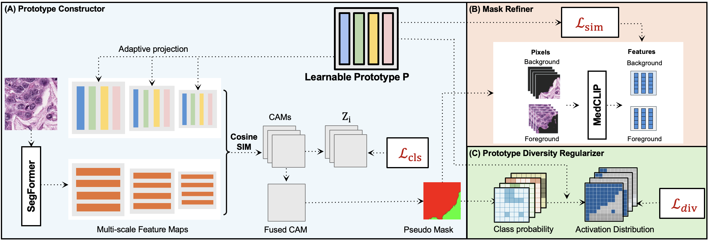

# LPD: Learnable Prototypes with Diversity Regularization for Weakly Supervised Histopathology Segmentation

**Official PyTorch implementation of paper LPD**

> **Cluster-Free Learnable Prototypes with Diversity Regularization for One-Stage Weakly Supervised Semantic Segmentation in Histopathology**

Hopefully
[📄 Paper]([Link to Paper PDF/arXiv])
[🌐 Project Page]([Link to Project Page/Website])

## Highlights

- **State-of-the-Art (SOTA)** performance on the BCSS-WSSS benchmark.
- **One-Stage, Cluster-Free Training**: Eliminates the costly, decoupled, two-stage training required by previous prototype-based methods (e.g., PBIP).
- **Diversity Regularization**: Introduces a novel loss based on Jeffrey's divergence to explicitly encourage intra-class prototypes to capture distinct morphological patterns, effectively addressing **intra-class heterogeneity**.
- **Histopathological Focus**: Specialized, high-accuracy WSSS for critical medical image analysis.

## Abstract

## Model Architecture (LPD Model Overview)

<div style="text-align: center;">
  
  <p>
    <em>
      Overview of the LPD architecture. The Prototype Constructor uses 
      <strong>learnable prototypes</strong> and is optimized end-to-end with the 
      <strong>Diversity Regularizer (blue, bottom)</strong>, replacing PBIP's static clustering bank.
    </em>
  </p>
</div>

The architecture maintains the spirit of feature alignment (as in PBIP's Mask Refiner) but achieves prototype discovery and mask generation in a single, efficient, unified stage.

## Installation

### Requirements

- Python **3.9**
- PyTorch **1.9+** (or latest stable version)
- CUDA **11.0+**
- Recommended: A machine with **$\ge$24GB GPU memory** for training.

### Environment Setup

#### Using `requirements.txt` (Recommended)

```bash
# Create a dedicated Conda environment
conda create -n lpd python=3.8
conda activate lpd

# Clone the repository
git clone https://github.com/tom1209-netizen/LPD.git
cd LPD

# Install dependencies
pip install -r requirements.txt
```

## Dataset: BCSS-WSSS

This project uses the **BCSS (Breast Cancer Semantic Segmentation)** dataset for weakly supervised segmentation (BCSS-WSSS). The method is trained solely with image-level labels.

| Class    | Description | Tissue Type  |
| -------- | ----------- | ------------ |
| **TUM**  | Tumor       | Epithelial   |
| **STR**  | Stroma      | Connective   |
| **LYM**  | Lymphocyte  | Inflammatory |
| **NEC**  | Necrosis    | Dying Tissue |
| **BACK** | Background  | N/A          |

### Data Preparation and Structure

Please organize the dataset structure as follows:

```[]
data/
├── BCSS-WSSS/
│   ├── train/
│   │   └── *.png  # Training images
│   ├── test/
│   │   ├── img/   # Test images
│   │   └── mask/  # Ground truth masks (for evaluation only)
│   └── valid/
│       ├── img/   # Validation images
│       └── mask/  # Ground truth masks (for evaluation only)
```

## Quick Start (One-Stage Training)

LDP is trained end-to-end using a single command.

### 1\. Download Pre-trained Weights

- Download the pre-trained SegFormer MiT-B1 encoder weights [here]([SegFormer Download Link]).
- Place the weight file into the `./pretrained_models/` directory.

### 2\. Training

Use the following command to train the full ProtoBIP model. This includes the classification loss ($\mathcal{L}_{\text{cls}}$), the similarity refinement loss ($\mathcal{L}_{\text{sim}}$), and the diversity regularizer ($\mathcal{L}_{\text{div}}$).

```bash
# Train the ProtoBIP model end-to-end
# The config file manages hyperparameters like lambda_sim and lambda_div.
python main.py --config ./work_dirs/bcss/protobip/config_10prot_div05.yaml --gpu 0
```

### 3\. Test and Visualize

To evaluate a trained model checkpoint on the test set:

```bash
# Evaluate the best checkpoint
python visualization_utils/test_and_visualize.py --checkpoint ./work_dirs/bcss/lpd/latest.pth --config ./work_dirs/bcss/lpd/config.yaml
```

## License and Citation

This project is licensed under the MIT License - see the [LICENSE](https://www.google.com/search?q=LICENSE) file for details.

If you find this work useful, please consider citing:
Hopefully

```bibtex
@inproceedings{[Your Paper ID],
  title={Cluster-Free Learnable Prototypes with Diversity Regularization for One-Stage Weakly Supervised Semantic Segmentation in Histopathology},
  author={[Your Authors]},
  booktitle={[Your Conference] (ISBI/CVPR)},
  year={[Your Year]}
}
```
